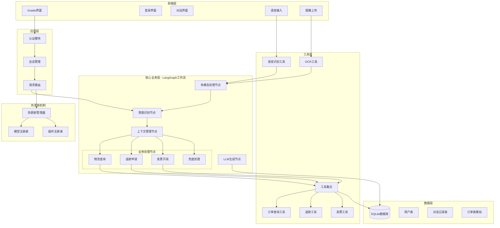

# 智能客服系统 - 架构设计与实现计划

## 产品目标

构建一个小型多轮对话智能客服系统,支持订单相关业务的自动化处理(物流查询、退款申请、发票开具),并具备多模态输入能力(语音、图像OCR)和热更新机制。

## 用户审核要点

> [!IMPORTANT]
> **技术选型最终确认**
> 
> 1. **LLM提供商**: ✅ 通义千问(Qwen)
> 2. **数据库**: ✅ SQLite (本地文件存储,简单轻量)
> 3. **前端技术**: ✅ Gradio (支持基础认证和会话管理)
> 4. **语音识别**: ✅ 阿里云ASR (云端服务,无需本地模型)
> 5. **OCR服务**: ✅ 阿里云OCR (云端服务,识别准确)
>
> **技术选型说明**:
> - **SQLite**: 零配置、单文件数据库,适合快速开发和演示
> - **Gradio认证**: 使用内置`auth`参数实现登录,通过`gr.State`管理会话
> - **阿里云ASR**: 实时语音识别,支持中文,无需下载模型
> - **阿里云OCR**: 高精度文字识别,支持多种场景

> [!WARNING]
> **功能范围确认**
> 
> 本实现计划基于产品需求文档v1.0,不包含以下功能:
> - 真实订单系统集成(使用模拟数据)
> - 生产级部署配置(仅本地开发环境)
> - 完整的用户权限管理系统
> 
> 如需调整功能范围,请在审核时说明。

---

## 系统架构设计

### 整体架构



### 核心组件说明

#### 1. **前端层 (Gradio)**
- **登录界面**: 简单的用户名/密码输入,不维护登录状态
- **对话界面**: 支持文本、语音、图像输入的多模态交互界面
- **实时反馈**: 显示系统处理状态和多轮对话历史

#### 2. **应用层**
- **认证模块**: 简单的用户验证,每次会话需要登录
- **会话管理**: 管理单次会话的上下文,不跨会话持久化登录状态
- **请求路由**: 将用户输入路由到LangGraph工作流

#### 3. **核心业务层 (LangGraph工作流)**

**状态定义**:
```python
class CustomerServiceState(TypedDict):
    user_id: str
    session_id: str
    messages: List[BaseMessage]
    user_input: str
    intent: str
    context: Dict[str, Any]  # 多轮对话上下文
    order_info: Optional[Dict]
    next_action: str
    response: str
```

**节点设计**:
1. **意图识别节点**: 使用LLM识别用户意图(物流查询/退款/发票/其他)
2. **上下文管理节点**: 管理多轮对话上下文,提取时间、订单号等信息
3. **业务处理节点**: 
   - 物流查询节点: 处理两种场景(关键字模糊查询、时间列表查询)
   - 退款申请节点: 查找符合条件的订单并处理退款
   - 发票开具节点: 订单检索并开具发票
   - 兜底处理节点: 友好提示暂不支持的场景
4. **LLM生成节点**: 生成自然语言回复
5. **多模态处理节点**: 处理语音和图像输入

**条件边设计**:
- 根据意图路由到不同业务节点
- 根据上下文完整性决定是否追问
- 根据查询结果决定下一步操作

#### 4. **工具层**
- **订单查询工具**: 
  - `query_order_by_keyword(keyword, date)`: 关键字+日期查询
  - `query_orders_by_date(date)`: 日期范围查询
  - `get_order_logistics(order_id)`: 获取物流状态
- **退款工具**: 
  - `query_refundable_orders(user_id)`: 查询可退款订单
  - `submit_refund(order_id)`: 提交退款申请
- **发票工具**: 
  - `query_invoiceable_orders(user_id, keyword)`: 查询可开票订单
  - `issue_invoice(order_id)`: 开具发票
- **多模态工具**:
  - `speech_to_text(audio)`: 语音转文本
  - `extract_order_number(image)`: OCR提取订单号

#### 5. **数据层 (SQLite)**

**数据库表设计 (SQLite)**:

```sql
-- 用户表
CREATE TABLE users (
    user_id TEXT PRIMARY KEY,
    username TEXT UNIQUE NOT NULL,
    password_hash TEXT NOT NULL,
    created_at TIMESTAMP DEFAULT CURRENT_TIMESTAMP
);

-- 对话记录表
CREATE TABLE conversations (
    id INTEGER PRIMARY KEY AUTOINCREMENT,
    conversation_id TEXT NOT NULL,
    user_id TEXT NOT NULL,
    session_id TEXT NOT NULL,
    message_role TEXT NOT NULL,  -- user/assistant/system
    message_content TEXT NOT NULL,
    created_at TIMESTAMP DEFAULT CURRENT_TIMESTAMP,
    FOREIGN KEY (user_id) REFERENCES users(user_id) ON DELETE CASCADE
);

-- 对话记录索引
CREATE INDEX idx_conv_user_session ON conversations(user_id, session_id);
CREATE INDEX idx_conv_id ON conversations(conversation_id);

-- 订单表(模拟数据)
CREATE TABLE orders (
    order_id TEXT PRIMARY KEY,
    user_id TEXT NOT NULL,
    order_name TEXT NOT NULL,
    order_date DATE NOT NULL,
    status TEXT NOT NULL DEFAULT 'pending',  -- pending/shipped/delivered/cancelled
    logistics_status TEXT,
    can_refund INTEGER DEFAULT 1,  -- SQLite uses INTEGER for boolean
    can_invoice INTEGER DEFAULT 1,
    created_at TIMESTAMP DEFAULT CURRENT_TIMESTAMP,
    FOREIGN KEY (user_id) REFERENCES users(user_id) ON DELETE CASCADE
);

-- 订单索引
CREATE INDEX idx_order_user_date ON orders(user_id, order_date);
CREATE INDEX idx_order_name ON orders(order_name);
```

#### 6. **热更新机制**

**模型热更新**:
- 使用配置文件定义模型参数
- 监听配置文件变化,动态重新加载模型
- 保证旧会话不受影响(使用会话级模型实例)

**插件热重载**:
- 使用Python的`importlib.reload()`机制
- 插件注册表管理插件生命周期
- 提供`/reload_plugin`接口手动触发重载

---

## 技术选型

### 核心依赖

| 组件 | 技术选型 | 版本 | 说明 |
|------|---------|------|------|
| LLM框架 | LangChain | >=0.3.0 | 对话链构建 |
| 工作流引擎 | LangGraph | >=0.2.6 | 多轮对话流程编排 |
| LLM提供商 | 通义千问(Qwen) | qwen-turbo | 意图识别和对话生成 |
| 数据库 | SQLite | 3.x | 本地文件存储 |
| 数据库ORM | SQLAlchemy | >=2.0.0 | 数据库操作 |
| 前端框架 | Gradio | >=4.0 | 快速构建交互界面 |
| 语音识别 | 阿里云ASR | - | 实时语音转文本 |
| OCR服务 | 阿里云OCR | - | 图像文字识别 |
| 环境管理 | python-dotenv | >=1.0 | 环境变量管理 |

### 可选依赖

| 组件 | 技术选型 | 用途 |
|------|---------|------|
| LangSmith | langsmith | 工作流监控和调试 |
| pytest | pytest | 自动化测试 |
| watchdog | watchdog | 文件监听(热更新) |

---

## 拟议变更

### 项目结构

```
week04-homework/
├── smart_customer_service/
│   ├── __init__.py
│   ├── main.py                    # 入口文件
│   ├── config/
│   │   ├── __init__.py
│   │   ├── settings.py            # 配置管理
│   │   └── model_config.yaml      # 模型配置(支持热更新)
│   ├── core/
│   │   ├── __init__.py
│   │   ├── auth.py                # 认证模块
│   │   ├── session.py             # 会话管理
│   │   └── hot_reload.py          # 热更新管理器
│   ├── workflow/
│   │   ├── __init__.py
│   │   ├── graph.py               # LangGraph工作流定义
│   │   ├── nodes.py               # 工作流节点
│   │   ├── state.py               # 状态定义
│   │   └── edges.py               # 条件边逻辑
│   ├── tools/
│   │   ├── __init__.py
│   │   ├── order_tools.py         # 订单相关工具
│   │   ├── multimodal_tools.py    # 多模态工具
│   │   └── base.py                # 工具基类
│   ├── database/
│   │   ├── __init__.py
│   │   ├── models.py              # 数据模型
│   │   ├── crud.py                # 数据库操作
│   │   └── init_db.py             # 数据库初始化
│   ├── ui/
│   │   ├── __init__.py
│   │   ├── gradio_app.py          # Gradio界面
│   │   └── components.py          # UI组件
│   └── utils/
│       ├── __init__.py
│       ├── time_parser.py         # 时间解析("昨天"→具体日期)
│       └── logger.py              # 日志工具
├── tests/
│   ├── __init__.py
│   ├── test_workflow.py           # 工作流测试
│   ├── test_tools.py              # 工具测试
│   ├── test_hot_reload.py         # 热更新测试
│   └── conftest.py                # pytest配置
├── data/
│   ├── customer_service.db        # SQLite数据库
│   └── mock_orders.json           # 模拟订单数据
├── .env.example                   # 环境变量示例
├── pyproject.toml                 # 项目依赖
└── README.md                      # 项目文档
```

---

### 核心模块详细设计

#### [NEW] [settings.py](file:///Users/culiang/Documents/GitHub/ai-engineer-training/week04-homework/smart_customer_service/config/settings.py)

**功能**: 配置管理,支持从环境变量和YAML文件加载配置

**关键配置项**:
- LLM配置: API密钥、模型名称、温度等
- 数据库配置: 数据库路径
- 多模态服务配置: ASR、OCR的API密钥
- 热更新配置: 监听路径、重载间隔

---

#### [NEW] [graph.py](file:///Users/culiang/Documents/GitHub/ai-engineer-training/week04-homework/smart_customer_service/workflow/graph.py)

**功能**: LangGraph工作流定义

**工作流结构**:
```
START → 多模态处理(可选) → 意图识别 → 上下文管理 → 条件路由
                                                        ↓
                                    ┌──────────────────┼──────────────────┐
                                    ↓                  ↓                  ↓
                                物流查询           退款申请           发票开具
                                    ↓                  ↓                  ↓
                                工具调用           工具调用           工具调用
                                    ↓                  ↓                  ↓
                                    └──────────────────┼──────────────────┘
                                                        ↓
                                                  LLM生成回复
                                                        ↓
                                                      END
```

**条件边逻辑**:
1. `should_process_multimodal`: 检查是否有语音/图像输入
2. `route_by_intent`: 根据意图路由到不同业务节点
3. `should_ask_more`: 判断上下文是否完整,决定是否追问
4. `should_call_tool`: 判断是否需要调用工具

---

#### [NEW] [nodes.py](file:///Users/culiang/Documents/GitHub/ai-engineer-training/week04-homework/smart_customer_service/workflow/nodes.py)

**功能**: 实现所有工作流节点

**关键节点**:

1. **`multimodal_processing_node`**: 处理语音和图像输入
   - 调用ASR工具将语音转文本
   - 调用OCR工具提取订单号
   - 更新状态中的`user_input`和`context`

2. **`intent_recognition_node`**: 意图识别
   - 使用LLM识别意图(物流查询/退款/发票/其他)
   - 更新状态中的`intent`

3. **`context_management_node`**: 上下文管理
   - 解析时间表达("昨天"→具体日期)
   - 提取订单号、关键字等信息
   - 判断上下文是否完整

4. **`logistics_query_node`**: 物流查询处理
   - 场景1: 关键字模糊查询
   - 场景2: 时间列表查询
   - 调用订单查询工具

5. **`refund_processing_node`**: 退款申请处理
   - 查找可退款订单
   - 处理退款申请

6. **`invoice_processing_node`**: 发票开具处理
   - 查找可开票订单
   - 处理发票开具

7. **`llm_response_node`**: LLM生成回复
   - 根据工具调用结果生成自然语言回复

---

#### [NEW] [order_tools.py](file:///Users/culiang/Documents/GitHub/ai-engineer-training/week04-homework/smart_customer_service/tools/order_tools.py)

**功能**: 订单相关工具实现

**工具列表**:
- `QueryOrderByKeywordTool`: 关键字+日期查询订单
- `QueryOrdersByDateTool`: 日期范围查询订单列表
- `GetOrderLogisticsTool`: 获取订单物流状态
- `QueryRefundableOrdersTool`: 查询可退款订单
- `SubmitRefundTool`: 提交退款申请
- `QueryInvoiceableOrdersTool`: 查询可开票订单
- `IssueInvoiceTool`: 开具发票

---

#### [NEW] [multimodal_tools.py](file:///Users/culiang/Documents/GitHub/ai-engineer-training/week04-homework/smart_customer_service/tools/multimodal_tools.py)

**功能**: 多模态输入工具(阿里云服务)

**工具列表**:
- `SpeechToTextTool`: 调用阿里云ASR API进行语音识别
  - 支持实时语音流识别
  - 高准确率中文识别
  - 需要阿里云AccessKey
- `ExtractOrderNumberTool`: 调用阿里云OCR API进行文字识别
  - 支持多种证件和场景识别
  - 高精度文字提取
  - 使用正则表达式提取订单号

---

#### [NEW] [models.py](file:///Users/culiang/Documents/GitHub/ai-engineer-training/week04-homework/smart_customer_service/database/models.py)

**功能**: 数据库模型定义(SQLAlchemy ORM for SQLite)

**模型类**:
- `User`: 用户模型
  - 字段: user_id(TEXT), username(TEXT), password_hash(TEXT), created_at(TIMESTAMP)
- `Conversation`: 对话记录模型
  - 字段: id(INTEGER), conversation_id(TEXT), user_id(TEXT), session_id(TEXT), message_role(TEXT), message_content(TEXT), created_at(TIMESTAMP)
- `Order`: 订单模型(模拟)
  - 字段: order_id(TEXT), user_id(TEXT), order_name(TEXT), order_date(DATE), status(TEXT), logistics_status(TEXT), can_refund(INTEGER), can_invoice(INTEGER), created_at(TIMESTAMP)

---

#### [NEW] [crud.py](file:///Users/culiang/Documents/GitHub/ai-engineer-training/week04-homework/smart_customer_service/database/crud.py)

**功能**: 数据库CRUD操作(SQLite + SQLAlchemy)

**关键函数**:
- `get_db_engine()`: 获取SQLite数据库引擎
- `get_db_session()`: 获取数据库会话(上下文管理器)
- `create_user(username, password)`: 创建用户,密码使用bcrypt加密
- `authenticate_user(username, password)`: 用户认证
- `save_conversation(user_id, session_id, role, content)`: 保存对话记录
- `get_conversation_history(user_id, session_id, limit=50)`: 获取对话历史
- `query_orders(user_id, **filters)`: 查询订单
- `update_order_status(order_id, status)`: 更新订单状态

---

#### [NEW] [hot_reload.py](file:///Users/culiang/Documents/GitHub/ai-engineer-training/week04-homework/smart_customer_service/core/hot_reload.py)

**功能**: 热更新管理器

**实现机制**:
1. **模型热更新**:
   - 使用`watchdog`监听`model_config.yaml`文件变化
   - 文件变化时重新加载配置并创建新的LLM实例
   - 使用会话级模型实例,保证旧会话不受影响

2. **插件热重载**:
   - 提供`reload_plugin(plugin_name)`接口
   - 使用`importlib.reload()`重新加载插件模块
   - 更新工具注册表

---

#### [NEW] [gradio_app.py](file:///Users/culiang/Documents/GitHub/ai-engineer-training/week04-homework/smart_customer_service/ui/gradio_app.py)

**功能**: Gradio界面实现

**认证方案**:
- 使用Gradio内置的`auth`参数实现登录
- 认证函数`authenticate(username, password)`验证用户凭据
- 登录成功后使用`gr.State`存储用户信息和会话ID

**界面组件**:
1. **对话界面** (登录后可见):
   - 对话历史显示区 (`gr.Chatbot`)
   - 文本输入框 (`gr.Textbox`)
   - 语音输入按钮 (`gr.Audio`)
   - 图像上传组件 (`gr.Image`)
   - 发送按钮 (`gr.Button`)
   - 会话状态管理 (`gr.State` 存储user_id和session_id)

3. **健康检查Tab**:
   - 系统状态显示
   - 热更新触发按钮

---

#### [MODIFY] [main.py](file:///Users/culiang/Documents/GitHub/ai-engineer-training/week04-homework/smart_customer_service/main.py)

**变更内容**:
- 初始化数据库
- 加载配置
- 启动热更新监听器
- 启动Gradio应用
- 提供健康检查接口`/health`

---

#### [MODIFY] [pyproject.toml](file:///Users/culiang/Documents/GitHub/ai-engineer-training/week04-homework/pyproject.toml)

**变更内容**: 添加项目依赖

```toml
dependencies = [
    "python-dotenv>=1.0.1",
    "langgraph>=0.2.6",
    "langchain>=0.3.0",
    "langchain-community>=0.3.0",
    "dashscope>=1.20.0",
    "gradio>=4.0.0",
    "sqlalchemy>=2.0.0",
    "bcrypt>=4.0.0",
    "pydantic>=2.0.0",
    "watchdog>=3.0.0",
    "pyyaml>=6.0.0",
    "alibabacloud-nls>=1.0.0",  # 阿里云语音识别
    "oss2>=2.18.0",  # 阿里云OSS(OCR需要)
]
```

---

#### [NEW] [.env.example](file:///Users/culiang/Documents/GitHub/ai-engineer-training/week04-homework/.env.example)

**功能**: 环境变量示例文件

```bash
# LLM配置
DASHSCOPE_API_KEY=your_dashscope_api_key

# SQLite数据库配置
DATABASE_PATH=./data/customer_service.db

# 阿里云ASR配置
ALIYUN_ACCESS_KEY_ID=your_access_key_id
ALIYUN_ACCESS_KEY_SECRET=your_access_key_secret
ALIYUN_ASR_APP_KEY=your_asr_app_key

# 阿里云OCR配置
ALIYUN_OCR_ACCESS_KEY_ID=your_ocr_access_key_id
ALIYUN_OCR_ACCESS_KEY_SECRET=your_ocr_access_key_secret

# LangSmith配置(可选)
LANGSMITH_API_KEY=your_langsmith_api_key
LANGSMITH_PROJECT=customer-service-system
```

---

## 环境准备

### 1. SQLite数据库初始化

**步骤**:

1. **创建数据目录**:
   ```bash
   cd /Users/culiang/Documents/GitHub/ai-engineer-training/week04-homework
   mkdir -p data
   ```

2. **初始化数据表**:
   ```bash
   python -m smart_customer_service.database.init_db
   ```
   
   该命令会:
   - 创建 SQLite 数据库文件 `./data/customer_service.db`
   - 创建 users, conversations, orders 表
   - 创建必要的索引

3. **插入模拟订单数据**:
   ```bash
   python -m smart_customer_service.database.init_db --load-mock-data
   ```
   
   会插入测试用户和模拟订单数据。

**SQLite 优势**:
- 零配置,无需安装数据库服务
- 单文件存储,便于备份和迁移
- 支持完整的SQL功能和事务

---

### 2. 阿里云服务配置

#### 2.1 获取阿里云AccessKey

1. 访问 [阿里云控制台](https://ram.console.aliyun.com/manage/ak)
2. 创建 AccessKey ID 和 AccessKey Secret
3. 保存到安全位置

#### 2.2 开通阿里云ASR服务

1. 访问 [阿里云语音服务](https://nls-portal.console.aliyun.com/)
2. 开通实时语音识别服务
3. 创建项目并获取 AppKey
4. 配置到 `.env` 文件:
   ```bash
   ALIYUN_ACCESS_KEY_ID=your_access_key_id
   ALIYUN_ACCESS_KEY_SECRET=your_access_key_secret
   ALIYUN_ASR_APP_KEY=your_asr_app_key
   ```

**ASR服务说明**:
- 支持实时语音流识别
- 高准确率中文识别
- 无需下载本地模型

#### 2.3 开通阿里云OCR服务

1. 访问 [阿里云OCR](https://vision.console.aliyun.com/)
2. 开通通用文字识别服务
3. 配置到 `.env` 文件:
   ```bash
   ALIYUN_OCR_ACCESS_KEY_ID=your_ocr_access_key_id
   ALIYUN_OCR_ACCESS_KEY_SECRET=your_ocr_access_key_secret
   ```

**OCR服务说明**:
- 支持多种证件和场景识别
- 高精度文字提取
- 支持中英文混合识别

---

### 3. 完整环境安装

**一键安装脚本**:

```bash
cd /Users/culiang/Documents/GitHub/ai-engineer-training/week04-homework

# 1. 安装Python依赖
uv sync

# 2. 复制环境变量模板
cp .env.example .env
# 然后编辑.env文件,填入实际配置

# 3. 初始化SQLite数据库
python -m smart_customer_service.database.init_db --load-mock-data

# 4. 运行系统
python -m smart_customer_service.main
```

**环境检查**:
```bash
# 检查数据库
ls -lh data/customer_service.db

# 检查依赖
pip list | grep -E "langgraph|gradio|dashscope|sqlalchemy"

# 测试阿里云连接
python -c "from smart_customer_service.tools.multimodal_tools import test_aliyun_connection; test_aliyun_connection()"
```

---

## 验证计划

### 自动化测试

#### 1. 工作流测试 (`tests/test_workflow.py`)

**测试用例**:
```python
def test_logistics_query_scenario1():
    """测试物流查询场景1: 基于关键字的模糊查询"""
    # 用户输入: "查看昨天购买的年货礼品发货了吗"
    # 验证: 系统能识别意图、解析时间、提取关键字、追问订单号

def test_logistics_query_scenario2():
    """测试物流查询场景2: 基于时间的订单列表查询"""
    # 用户输入: "查看昨天下单的订单发货了吗"
    # 验证: 系统能列举订单列表、等待用户选择、返回物流状态

def test_refund_application():
    """测试退款申请流程"""
    # 用户输入: "我要退货"
    # 验证: 查找可退款订单、列举清单、处理退款申请

def test_invoice_issuance():
    """测试发票开具流程"""
    # 用户输入: "我要开具发票"
    # 验证: 追问订单号、检索订单、开具发票

def test_unsupported_intent():
    """测试不支持的场景"""
    # 用户输入: "我要投诉"
    # 验证: 给出友好提示
```

**运行命令**:
```bash
cd /Users/culiang/Documents/GitHub/ai-engineer-training/week04-homework
python -m pytest tests/test_workflow.py -v
```

---

#### 2. 工具测试 (`tests/test_tools.py`)

**测试用例**:
```python
def test_query_order_by_keyword():
    """测试关键字查询订单工具"""

def test_query_orders_by_date():
    """测试日期查询订单工具"""

def test_submit_refund():
    """测试退款工具"""

def test_issue_invoice():
    """测试发票工具"""

def test_speech_to_text():
    """测试语音转文本工具(使用mock)"""

def test_extract_order_number():
    """测试OCR提取订单号工具(使用mock)"""
```

**运行命令**:
```bash
cd /Users/culiang/Documents/GitHub/ai-engineer-training/week04-homework
python -m pytest tests/test_tools.py -v
```

---

#### 3. 热更新测试 (`tests/test_hot_reload.py`)

**测试用例**:
```python
def test_model_hot_reload():
    """测试模型热更新"""
    # 1. 启动系统,创建会话A
    # 2. 修改model_config.yaml
    # 3. 验证新会话B使用新配置
    # 4. 验证旧会话A不受影响

def test_plugin_hot_reload():
    """测试插件热重载"""
    # 1. 修改发票插件代码
    # 2. 调用/reload_plugin接口
    # 3. 验证新功能生效
```

**运行命令**:
```bash
cd /Users/culiang/Documents/GitHub/ai-engineer-training/week04-homework
python -m pytest tests/test_hot_reload.py -v
```

---

### 手动验证

#### 1. 端到端对话测试

**步骤**:
1. 启动系统:
   ```bash
   cd /Users/culiang/Documents/GitHub/ai-engineer-training/week04-homework
   python -m smart_customer_service.main
   ```

2. 在浏览器打开Gradio界面(通常是 http://127.0.0.1:7860)

3. 测试登录功能:
   - 输入用户名和密码
   - 验证登录成功

4. 测试物流查询场景1:
   - 输入: "查看昨天购买的年货礼品发货了吗"
   - 验证系统追问订单号
   - 输入订单号
   - 验证返回物流状态

5. 测试物流查询场景2:
   - 输入: "查看昨天下单的订单发货了吗"
   - 验证系统列举订单列表
   - 输入订单号
   - 验证返回物流状态

6. 测试退款申请:
   - 输入: "我要退货"
   - 验证系统列举可退款订单
   - 输入订单号
   - 验证退款成功提示

7. 测试发票开具:
   - 输入: "我要开具发票"
   - 验证系统追问订单号
   - 输入订单号
   - 验证发票开具成功

8. 测试不支持的场景:
   - 输入: "我要投诉"
   - 验证友好提示

---

#### 2. 多模态输入测试

**步骤**:
1. 测试语音输入:
   - 点击语音输入按钮
   - 说"查看我的订单"
   - 验证语音转文本成功
   - 验证系统正确处理

2. 测试图像OCR:
   - 上传包含订单号的图片
   - 验证OCR提取订单号成功
   - 验证系统使用提取的订单号查询

---

#### 3. 热更新验证

**步骤**:
1. 测试模型热更新:
   - 启动系统,开始一个对话会话A
   - 修改`config/model_config.yaml`,更改温度参数
   - 等待配置重新加载(观察日志)
   - 开始新对话会话B,验证新参数生效
   - 回到会话A,验证旧参数仍然有效

2. 测试插件热重载:
   - 修改`tools/order_tools.py`中的发票工具,添加日志输出
   - 访问健康检查Tab,点击"重载插件"按钮
   - 测试发票开具功能,验证新日志输出

---

#### 4. 健康检查接口测试

**步骤**:
1. 访问健康检查接口:
   ```bash
   curl http://127.0.0.1:7860/health
   ```

2. 验证返回JSON:
   ```json
   {
     "status": "healthy",
     "database": "connected",
     "llm": "available",
     "timestamp": "2026-02-10T19:30:00"
   }
   ```

---

## 实现顺序

1. **阶段一: 基础设施** (预计2-3小时)
   - 项目结构搭建
   - 配置管理实现
   - 数据库设计和初始化
   - 模拟订单数据准备

2. **阶段二: 核心工作流** (预计4-5小时)
   - LangGraph工作流定义
   - 意图识别节点实现
   - 上下文管理节点实现
   - 业务处理节点实现(物流/退款/发票)
   - 工具层实现

3. **阶段三: 多模态支持** (预计2-3小时)
   - 语音识别工具集成
   - OCR工具集成
   - 多模态处理节点实现

4. **阶段四: 前端界面** (预计2小时)
   - Gradio界面实现
   - 登录功能集成
   - 多模态输入组件

5. **阶段五: 热更新机制** (预计2-3小时)
   - 模型热更新实现
   - 插件热重载实现
   - 健康检查接口

6. **阶段六: 测试和优化** (预计2-3小时)
   - 编写自动化测试
   - 端到端测试
   - 性能优化

---

## 风险和限制

### 技术风险

1. **多模态服务依赖**
   - 风险: 阿里云ASR/OCR服务可能不稳定或需要付费
   - 缓解: 提供降级方案,使用本地OCR库(如PaddleOCR)作为备选

2. **LLM响应质量**
   - 风险: 意图识别和上下文理解可能不准确
   - 缓解: 使用结构化输出、Few-shot示例、降级到规则匹配

3. **热更新稳定性**
   - 风险: 热更新可能导致系统不稳定
   - 缓解: 充分测试、提供回滚机制、使用会话隔离

### 功能限制

1. **简化的认证**: 不维护登录状态,每次会话需要重新登录
2. **模拟订单数据**: 不集成真实订单系统
3. **本地部署**: 仅支持本地开发环境,不包含生产级部署配置

---

## 后续扩展方向

1. **生产级部署**:
   - Docker容器化
   - PostgreSQL数据库
   - Redis会话管理
   - Nginx反向代理

2. **功能增强**:
   - 真实订单系统集成
   - 更多业务场景支持
   - 情感分析
   - 用户满意度评分

3. **性能优化**:
   - LLM响应缓存
   - 异步处理
   - 负载均衡

4. **监控和运维**:
   - LangSmith深度集成
   - Prometheus指标收集
   - 日志聚合和分析


   📋 下一步工作
LangGraph工作流集成
Gradio用户界面
通义千问LLM集成
阿里云ASR/OCR集成
热更新机制
